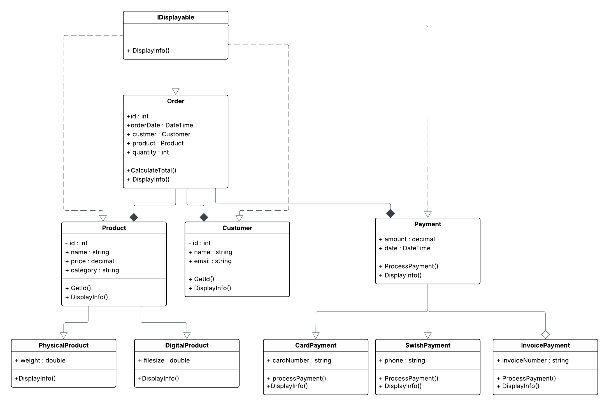

# E-handelssystem (UML + C#)

Detta projekt är en förenklad modell av ett e-handelssystem byggt med **objektorienterad programmering i C#**.  
Syftet är att öva på UML-diagram, OOP-principer och att översätta design till kod.  

## Funktioner
- **Produkter** kan vara både fysiska och digitala (arv från en abstrakt `Product`-klass).  
- **Kunder** kan lägga en order på en produkt.  
- **Order** innehåller kund, produkt, antal samt kan räkna ut totalpris.  
- **Betalningar** stöds i flera former:
  - `CardPayment`  
  - `SwishPayment`  
  - `InvoicePayment`  
- Alla betalningar ärver från den abstrakta klassen `Payment` och implementerar sin egen logik.  

## OOP-principer som används
- **Inkapsling**: vissa fält (t.ex. `id`) är privata och nås via metoder.  
- **Arv & Abstraktion**: `PhysicalProduct` och `DigitalProduct` ärver från den abstrakta `Product`. `Payment` är en abstrakt klass som ligger till grund för flera betalningsklasser.  
- **Polymorfism**: `DisplayInfo()` och `ProcessPayment()` implementeras olika i varje subklass, men kan anropas via samma referens.  
- **Interface**: `IDisplayable` används av alla klasser för att visa information.  

## UML-diagram

## Körning
Projektet är en **Console Application**.  
I `Program.cs` skapas kunder, produkter, ordrar och betalningar. Därefter visas information i konsolen.  

.
